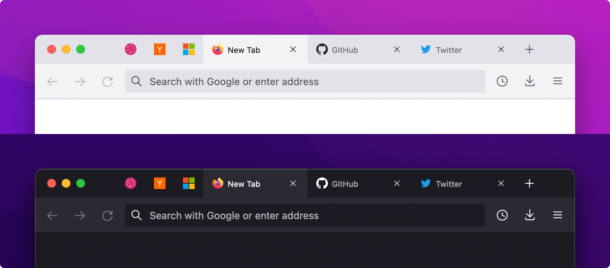

Firefox Proton Custom
=====================

Firefox default theme customization that replaces the floating tabs with a more conventional, cleaner interface. Requires Firefox 89.0 or later with Proton enabled. Supports both the normal and compact density mode.

Installation
------------

1. Enter `about:config` and enable `toolkit.legacyUserProfileCustomizations.stylesheets`
2. Enter `about:profiles` and open the active profile directory in your file explorer
3. Copy and paste the provided `chrome` directory into the profile directory
4. Restart Firefox to apply the theme customization

Preview
-------

Theme customization preview in light and dark mode on macOS.

